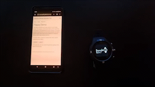

# Flappy Demo

This demo will allow you to play a game on your bangle device. The bangle.js code for this demo can be found <a href="https://github.com/espruino/BangleApps/blob/master/apps/flappy/app.js">here</a>. This program was developed by <a href="https://github.com/gfwilliams">Gordon Williams</a>. This demo serves to demonstrate how the remote uploader tool can be used to easily
upload open source projects to a Espruino device, without any external services.

To use the demo, connect to a device then select upload using the buttons below. 

<button onclick="connect()" class="btn"> connect </button>
<button onclick="upload()" class="btn"> upload </button>

 

Once uploaded, you can control the game by tapping on the devices touchscreen.

