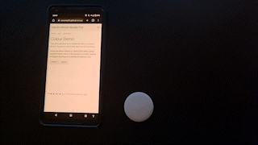

# Colour Demo

This demo will allow you to enable the LEDs on a puck.js device. The puck.js code for this demo can be found <a href="https://github.com/cmurray95/Dissertation/blob/main/src/demos/colour-test.js">here</a>.

To use the demo, connect to a device then select upload using the buttons below. If the upload is succesful, buttons will appear allowing you to activate the devices LEDs.

<button onclick="connect()" class="btn"> connect </button>
<button onclick="upload()" class="btn"> upload </button>

  <button onclick="red();" class="red"></button> 
  

  <button onclick="blue();" class="blue"></button> 
  

  <button onclick="green();" class="green"></button>
   

  <button onclick="disableLEDs();" class="btn">Reset LEDs</button>

  

